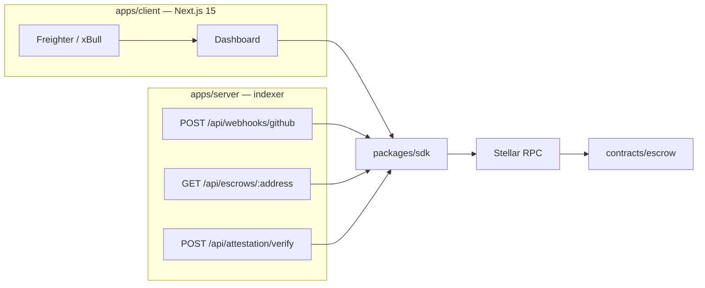

# Astra Flow

Decentralized **conditional escrow** and **milestone payment settlement** for the Stellar network. Astra Flow is the open-source engine maintained by [AstraProtocols](https://github.com/AstraProtocols): funders lock USDC or XLM in a Soroban contract, recipients submit proof hashes, and funders or arbitrators release each milestone.



## Monorepo layout

| Path | Role |
| --- | --- |
| `contracts/escrow` | Soroban Rust contract (`EscrowState`, `Milestone`, `EscrowConfig`) |
| `apps/client` | Next.js 15 App Router dashboard (Astra Minimal Dark) |
| `apps/server` | Express webhook relay and milestone indexer |
| `packages/sdk` | TypeScript helpers: initialize, decode events, ScVal serialize |
| `tools/scripts` | Testnet deploy + local lifecycle seed |

npm workspaces: `apps/client`, `apps/server`, `packages/sdk`. Cargo workspace members: `contracts/*`.

## Prerequisites

- Node.js 20+ (22 recommended; see `.nvmrc`)
- npm 10+
- Rust stable with `wasm32v1-none` (and optionally `wasm32-unknown-unknown`)
- [Stellar CLI](https://developers.stellar.org/docs/tools/developer-tools/cli/install-cli) (`stellar`)

```bash
rustup target add wasm32v1-none wasm32-unknown-unknown
```

## Local development

```bash
git clone https://github.com/AstraProtocols/astra-flow.git
cd astra-flow
cp .env.example .env
npm install
```

Run the TypeScript workspace (client on `:3000`, indexer on `:4000`) with Turbo:

```bash
npm run dev
```

Or with Concurrently (SDK watch + server + client):

```bash
npm run dev:concurrent
```

### Contracts

```bash
cargo test -p escrow
stellar contract build
# equivalent:
cargo build --target wasm32v1-none --release
```

The compiled artifact is `target/wasm32v1-none/release/escrow.wasm`.

### Deploy to Testnet

```bash
chmod +x tools/scripts/deploy-testnet.sh
npm run deploy:testnet
```

The script builds WASM, funds a `astra-deployer` identity, deploys the contract, and writes `ESCROW_CONTRACT_ID` / `NEXT_PUBLIC_ESCROW_CONTRACT_ID` into `.env`.

### Seed a mock lifecycle

```bash
npm run seed:milestone
```

## Contract surface

| Function | Auth | Effect |
| --- | --- | --- |
| `initialize(funder, recipient, arbitrator, token, milestones)` | Funder | Stores config; state `Pending` |
| `deposit_funds()` | Funder | `transfer_from` allowance → contract; state `Active` |
| `submit_milestone_proof(id, proof_hash)` | Recipient | Records proof hash |
| `approve_milestone(id)` | Funder (or arbitrator if `Disputed`) | Pays `payout_amount` to recipient |
| `raise_dispute()` | Funder | Locks unreleased balances; state `Disputed` |

## Indexer HTTP API

| Method | Path | Purpose |
| --- | --- | --- |
| `POST` | `/api/webhooks/github` | Verify GitHub HMAC, map merged PRs to proof submissions |
| `GET` | `/api/escrows/:address` | Aggregate active + historical escrows for a wallet |
| `POST` | `/api/attestation/verify` | Validate multi-party attestations before approval txs |

## UI theme — Astra Minimal Dark

- Base `#070A0F`
- Cards `#0F1622`
- Accent cyan `#00F5FF`
- Completed / released emerald `#10B981`

## License

Apache-2.0. See [CONTRIBUTING.md](./CONTRIBUTING.md) for engineering standards.
